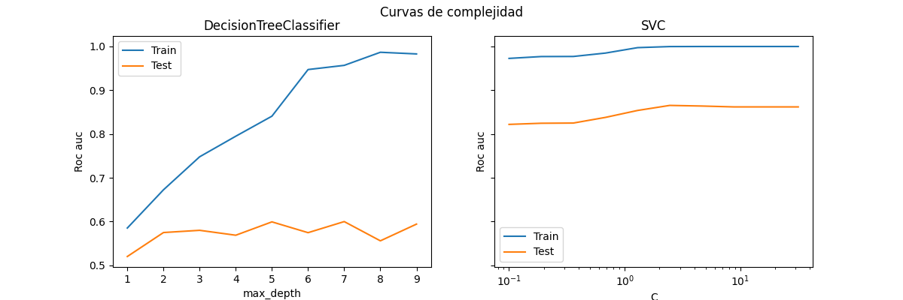
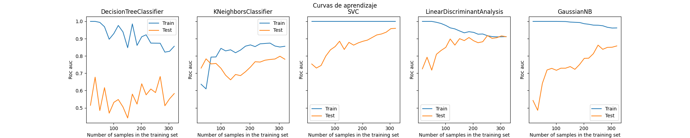
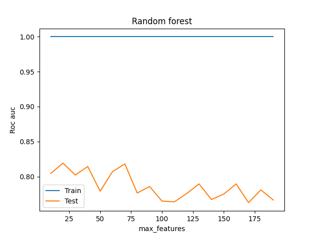
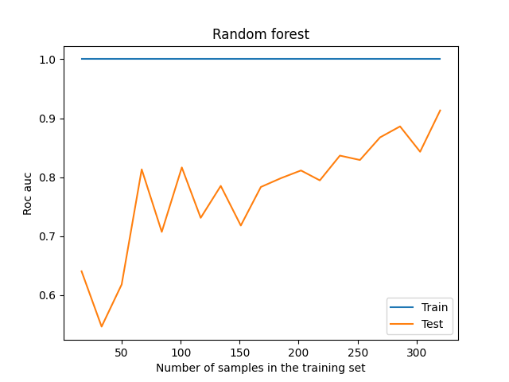
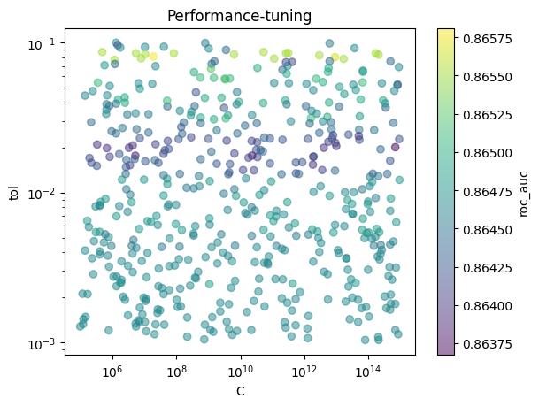

# Trabajo Práctico - Aprendizaje supervisado
## Clasificación de expresiones genómicas

### Árbol de indecisión
### Integrantes:
- Freire, Guido LU: 978/21
- Motta, Facundo LU: 889/21
- Rodriguez, Ignacio LU: 956/21
- Wisznia, Juan LU: 520/16

---

# Ejercicio 1
## Separación de datos

Dado que tenemos una base de datos acotada (500 datos), consideramos que utilizar el 10% de los datos como test set, es poco confiable (50 datos). Consideramos que 50 datos no nos proporcionan realmente una certeza acorde a la que buscamos para testear que tan bueno es nuestro modelo. Con este objetivo, decidimos separar el 20% de los datos para test, porque queremos una buena estimación del AUCROC para el modelo final. Para esto implementamos la función ```desarrollo_evaluacion```, que toma las últimas filas del dataframe. 

Sin embargo, los datos podrían estar "cargados" al dataset de cierta manera provocando asi que los ultimos datos del dataset tengan un patron que el modelo sea incapaz de generalizar. En este sentido buscamos que el conjunto de testeo sea una buena representación del dataset, entonces antes de separar los datos permutamos las filas del dataframe de forma aleatoria usando la función ```sample``` de pandas (toma una muestra de todo el dataset, sin reposicion. Es decir, lo permuta).

Una vez separados los datos en un conjunto de entrenamiento y un conjunto de evaluacion o test, aplicaremos preferentemente K-fold cross validation (a menos que una consigna indique otra forma de entrenamiento) y todos los modelos o metodos sobre el conjunto de entrenamiento sin tocar el conjunto de test, para no obtener ni inferir informacion respecto de este conjunto. Finalmente, al momento de indicar el indice de certeza que tiene nuestro modelo utilizaremos este conjunto de evaluacion, sobre el cual aplicaremos el modelo que consideremos pertinente y del cual, en ningun momento habremos obtenido informacion al respecto, como si predicieramos datos "nuevos" en nuestro data frame.

# Ejercicio 2
## Construcción de modelos

1. Entrenamos el árbol de decisión de altura máxima 3 y estimamos con K-fold cross validation usando ```model_selection.cross_validate``` de sklearn con
cv = 5.

2. Para calcular el AUPRC usamos ```average_precision```, que calcula el área debajo de la curva PRC **sin interpolar**. Osea, algo más bien parecido
a la suma de Riemann:

$$ \text{AP} = \sum_n (R_n - R_{n-1})P_n $$

donde $R_n$ es el recall y $P_n$ la precisión. Los resultados que obtuvimos estan en la tabla:

| Permutación | Accuracy (training) | Accuracy (validación) | AUPRC (training) | AUPRC (validación) | AUCROC (training) | AUCROC (validación) |
| -----       | -----               | -----                 | -----            | -----              | -----             | -----               |
| 1           | 0.821               | 0.687                 | 0.740            | 0.475              | 0.840             | 0.650               |
| 2           | 0.759               | 0.662                 | 0.625            | 0.425              | 0.800             | 0.666               |
| 3           | 0.853               | 0.737                 | 0.737            | 0.507              | 0.835             | 0.737               |
| 4           | 0.840               | 0.650                 | 0.718            | 0.343              | 0.839             | 0.550               |
| 5           | 0.828               | 0.700                 | 0.723            | 0.480              | 0.860             | 0.666               |
| Promedios   | 0.820               | 0.687                 | 0.709            | 0.446              | 0.837             | 0.654               |
| Global      | (NO)                | 0.687                 | (NO)             | 0.397              | (NO)              | 0.619               |

*Tabla 2.1*

3. Definimos una ```ParameterGrid``` de sklearn con los parámetros que queremos probar con el árbol de decisión y usamos ```cross_validate``` con la métrica accuracy. Los resultados fueron:

| Altura máxima | Criterio de corte | Accuracy (training) | Accuracy (validación) |
| -----         | -----             | -----               | -----                 |
| 3             | Gini              | 0.820               | 0.687                 |
| 5             | Gini              | 0.938               | 0.657                 |
| Inf           | Gini              | 1.000               | 0.650                 |
| 3             | Entropía          | 0.795               | 0.717                 |
| 5             | Entropía          | 0.908               | 0.657                 |
| Inf           | Entropía          | 1.000               | 0.655                 |

*Tabla 2.2*

4. De la tabla 2.1 vemos que los folds obtienen scores parecidos dentro de una métrica. Interpretamos que los datos están representados de forma pareja en cada uno de ellos. Tiene sentido que el promedio sea cercano a cada uno de los folds. También cabe notar que usar la evaluación *Global* recomendada en clase es muy cercana al promedio, pero siempre por debajo del mismo. Según 2.1 la peor métrica para este modelo es AUPRC.

En la tabla 2.2 es claro que subir la altura máxima del árbol aumenta la precisión en training. De hecho, al entrenar un árbol completo cada dato de entrenamiento está bien clasificado (precisión 1). Sin embargo la varianza es muy alta ("overfitting") y la precisión empeora. El criterio de corte entropía es marginalmente mejor que gini.

# Ejercicio 3
## Comparacion de algoritmos

Comparemos la certeza de ciertos algoritmos de clasificacion mediante la metrica AUCROC resultante de un 5-fold cross validation. En este caso compararemos los algoritmos:
* Árboles de decisión (ADD)
* KNN (k-vecinos más cercanos)
* SVM (Support vector machine)
* LDA (Linear discriminant analysis)
* Naïve Bayes

Además compararemos "intra" algoritmos, es decir, compararemos mismos algoritmos con distintos hiperparametros y asi poder analizar como afectan el rendimiento de cada algoritmo. En este sentido, utilizaremos un ```RandomizedSearchCV``` que nos permite buscar de forma aleatoria en la grilla o "hipercubo" que generan los distintos intervalos/regiones para cada hiperparametro de cada modelo.

Comenzaremos delimitando cuales hiperparametros utilizar para cada modelo y sus respectivos intervalos (*Tabla 3.1*) y/o valores que pueden tomar los mismos. Los dominios de cada hiperparámetro los elegimos "a ojo", leyendo la documentación de cada modelo y pensando valores razonables.

| Modelo        | Hiperparámetro    | Intervalo / Valores posibles      | Descripción           |
| -----         | -----             | -----                             | -----                 |
| ADD           | max_depth         | [1,2, ..., 19]                    | Altura maxima del arbol|
| ADD           | Criterion         | ['gini', 'entropy', 'log_loss']   | Estrategia utilizada para separar en cada nodo|
| ADD           | max_features      | ['sqrt', 'log2']                  | Numero de features al considerar el mejor corte|
| KNN           | n_neighbors       | [1,2, ..., 19]                    | Cantidad de vecinos mas cercanos a observar|
| KNN           | metric            | ['l1', 'l2', 'cosine']            | Metrica utilizada para calcular la distancia entre observaciones|
| SVM           | C                 | [1, 1.5, 2, ...., 19.5]          | Citerio de regularizacion, inversamente proporcional a la fuerza de regularizacion buscada|
| SVM           | tol               | [1e-1, 1e-2, ..., 1e-5]           | Criterio de tolerancia para frenar algoritmo|
| SVM           | kernel            | ['linear', 'rbf']                 | Nucleo utilizado en el algoritmo, "genera" la forma de las regiones delimitadas|
| LDA           | solver            | ['lsqr', 'eigen']                 | Metodo utilizado para resolver el problema|
| LDA           | shrinkage         | [None, 'auto', 0.1, 0.5, 1.0]     | Controla si se utiliza o no el enfoque de "contraccion" de la amtriz de covarianza|
| Naive Bayes   | priors            | [0, 0.01, 0.02, ...., 0.99]       | Probabilidades inciales para las clases|

*Tabla 3.1*

Para analizar la performance imprimimos los valores que se guardan en ```RandomizedSearchCV.cv_results_```. Los resultados completos están en el código, pero en la *Tabla 3.2* mostramos las mejores (😃) y peores (😥) combinaciones de hiperparámetros para cada modelo:

### Árbol de decisión
| max_features        | max_depth    | criterion      | score           |
| -----               | -----        | -----          | -----           |
| log2                | 1            | gini           | 0.594 😃        |
| log2                | 10           | log_loss       | 0.579 😃        |
| log2                | 8            | gini           | 0.526 😥        |
| log2                | 1            | log_loss       | 0.505 😥        |

Es llamativo que la mejor y peor combinación son iguales, excepto que la mejor usa gini y la peor log_loss. Algo parecido pasa con la segunda mejor y peor combinación, que tienen una altura profunda (10 y 8) pero esta vez el gini es el que tiene peor rendimiento!
Igualmente, el rendimiento del modelo es bastante pobre para todas las configuraciones.

### KNN
| n_neighbors         | metric       | score           |
| -----               | -----        | -----           |
| 14                  | l1           | 0.840 😃        |
| 17                  | 11           | 0.838 😃        |
| 19                  | l2           | 0.812 😃        |
| 6                   | l2           | 0.778 😥        |
| 1                   | l1           | 0.643 😥        |

Acá es claro que el parámetro n_neghbors (que es el K de KNN) funciona mejor con valores entre 10-20 y funciona mal con valores <10.
El modelo tiene performance mejor que la del árbol de decisión. Incluso para las peores configuraciones.

### SVM

| param_tol | param_kernel | param_C | mean_test_score |
| --------- | ------------ | --------| --------------- |
| 0.1       | rbf          | 9.526   | 0.891 😃        |
| 0.001     | rbf          | 6.684   | 0.891 😃        |
| 0.1       | linear       | 8.105   | 0.847 😥        |
| 0.01      | linear       | 8.105   | 0.847 😥        |

El kernel rbf tiene mejor performance. Es decir, los datos se pueden discriminar usando la distancia entre ellos. Esto tiene sentido si recordamos que KNN también tuvo buenos resultados; otro método que explota la distancia entre instancias para predecir.

### LDA y Naive Bayes

| param_solver | param_shrinkage | mean_test_score |
| ------------ | --------------- | --------------- |
| lsqr         | 0.1             | 0.888 😃        |
| eigen        | 0.1             | 0.888 😃        |
| eigen        | 1.0             | 0.763 😥        |

| param_priors                           | mean_test_score |
| -------------------------------------- | --------------- |
| [0.979, 0.020]                         | 0.822 😃        |
| [0.151, 0.848]                         | 0.822 😃        |
| [0.0, 1.0]                             | 0.500 😥        |

Los parámetros para estos modelos no parecen tener un peso tan fuerte en las predicciones finales. Para LDA quizá no se exploró el espacio lo suficiente como para dar con combinaciones malas, pero en general el modelo tiene buen desempeño.

Con Naive Bayes el modelo converge sin importar el prior por la cantidad de datos y el problema en sí, que es de clasificación binaria.

# Ejercicio 4
## Diagnóstico Sesgo-Varianza.

Con el objetivo de analizar el sesgo y la varianza de los mejores modelos obtenidos (mayor AUCROC) de los distintos algoritmos, utilizaremos modelos entrenados variando los hiperparámetros o la cantidad de datos. Estas técnicas nos permitirán analizar y comprender cuando un modelo tiene o podría tener alto/bajo sesgo y/o varianza. En este sentido, comenzaremos variando los hiperparámetros ```max_depth``` y ```C``` de los modelos árbol de decisión y SVM respectivamente, los AUCROC obtenidos se observan en el _Gráfico 4.1_ a los que llamamos curvas de complejidad. 

El modelo de árbol de decisión parece tener un sesgo alto cuando el valor del ```max_depth``` es bajo (no capta el patrón de los datos de entrenamiento). A medida que este aumenta, se observa que la métrica mejora significativamente en el caso del conjunto de entrenamiento, no así en el conjunto de evaluación/test. Esto podría deberse a varias razones, por ejemplo, nuestro árbol podría estar sobreajustando, si esto ocurriera nuestro árbol no encontrará patrones significativamente generalizables dando así una baja métrica en el conjunto de test. Sin embargo, esta idea quedaría fácilmente descartada al observar que el conjunto de evaluación, sin importar el valor de ```max_depth```, siempre es bajo y en ningún momento logra un pico claro o la convergencia hacia algún valor. Si comparamos el rendimiento del árbol de decisión con el de los modelos SVM podemos observar un sobreajuste de el primero, se obtiene un mejor AUCROC sobre el conjunto de evaluación para valores más bajos en el conjunto de entrenamiento. 

Podríamos concluir entonces, que el causante de que nuestra métrica sea baja y por ende un modelo malo, es la alta varianza del mismo. El modelo puede ser muy sensible al ruido en los datos de entrenamiento. El árbol de decisión no es un modelo lo suficientemente robusto para los datos con los que estamos trabajando. Veamos que sin importar el valor de la altura máxima del árbol, el AUCROC del conjunto de test no logra superar en ningún momento un valor considerable como para tener en cuenta al modelo como "bueno". 

En el caso del SVM, ocurre exactamente lo opuesto. Se puede observar que cuando movemos el hiperparámetro ```C```, no varía mucho el valor de la métrica tanto en el conjunto de entrenamiento como en el de test. Por ende, parecería que el modelo es lo suficientemente robusto como para captar valores o condiciones más generales de los datos. La amplitud entre la curva de entrenamiento y la de test, se mantiene casi constante, el modelo se adapta muy bien a los patrones del conjunto de entrenamiento pero sigue aumentando su rendimiento en el conjunto de evaluación. Por último, podríamos decir que la casi nula variación (convergencia) en la métrica del conjunto de test indicaría una baja varianza del algoritmo, ya que para cualquier valor de ```C``` capta generalidades que logran una buena métrica. 

<p align="center">
  
</p>
<p align="center"><em>Gráfico 4.1</em></p>

En la siguiente parte para continuar con el análisis Sesgo-Varianza veremos qué ocurre con los modelos cuando variamos la cantidad de datos con las que entrenan, es decir, variamos la cantidad de instancias del conjunto de entrenamiento. No entraremos muy en detalle para cada modelo en particular, pero compararemos que diferencias o similitudes hay entre estos al momento de aplicar lo dicho previamente. En este sentido, se hace el gráfico de las curvas de aprendizaje de los modelos (_Grafico 4.2_). 

Veamos entonces que en el caso del primer modelo (ADD) a medida que se aumenta el conjunto de entrenamiento, no se observa una mejora en la métrica del conjunto de test a diferencia de lo que pasa con el resto de modelos en donde, a medida que aumenta la cantidad de datos de entrenamiento este métrica si mejora, deduciendo así que el ADD tiene un sesgo alto, esto significa que el modelo se ajusta demasiado a los datos de entrenamiento. A medida que aumenta la cantidad de datos, se observa una clara variación en su rendimiento en el conjunto de entrenamiento y no puede generalizar bien a nuevos datos. Esto se corresponde con una varianza alta. 

Al observar ahora los gráficos de los distintos modelos que no son el ADD, sugerirían que el rendimiento puede mejorar con el incremento de datos en el conjunto de entrenamiento dejando en claro así, el bajo sesgo de los mismos en comparación con el modelo de ADD. Además, el valor de AUCROC para el cual estarían convergiendo pareciera lo suficientemente alto deduciendo de esta otra manera poca varianza en los mismos. 

Finalmente podemos observar el modelo GaussianNB en particular comparado con modelos como el SVM o el LDA. La convergencia del GaussianNB parecería converger en un valor cercano al 0.7 a diferencia del SVM o LDA que ronda el 0.9. Esta diferencia podría deducirse de un sobreajuste del modelo y por ende una varianza mayor del mismo. Decimos que este modelo sobreajusta ya que el modelo GaussianNB en el conjunto de entrenamiento obtiene una métrica cercana a 1, la cual casi no varia a medida que aumentan los datos, sin embargo, la convergencia del AUCROC en el conjunto de test es más modesta que en otros casos ya nombrados. 

<p align="center">
  
</p>
<p align="center"><em>Gráfico 4.2</em></p>

Para finalizar con este análisis haremos un modelo de Random Forest, con 200 árboles que luego mediante una votación "democrática" definirán la clase correspondiente. Analizaremos la variable ```max_features``` que define el número máximo de variables aleatorias que se consideran al dividir un nodo durante la construcción de cada árbol. 

En el _Grafico 4.3_ podemos ver que al variar el valor de ```max_features``` no se logra un mejor rendimiento del random forest. Nosotros entendemos que esto se debe a un balance entre el sesgo y la varianza del modelo, ya que un valor de ```max_features``` alto podría sobre ajustar los árboles provocando así una alta varianza, mientras que un valor bajo de ```max_features``` puede aumentar el sesgo al limitar la capacidad del modelo para capturar generalidades en los datos. 

<p align="center">
  
</p>
<p align="center"><em>Gráfico 4.3</em></p>

Continuando con el análisis del RF (Random Forest), veamos que ocurre con este modelo cuando variamos la cantidad de datos con la que entrena, observemos entonces la curva de aprendizaje del modelo _Grafico 4.4_. Se logra observar una mejora en el rendimiento (incremento de la métrica AUCROC), sin embargo, se observa una convergencia de este modelo cercana al 0.8, menor que la de algunos modelos analizados previamente como el SVM o el LDA. 

De cualquier manera, este incremento en la métrica era predecible, ya que, generalmente, al acceder a más datos, el modelo puede encontrar generalidades que le servirán para predecir y/o obtener una mejor métrica en un conjunto no visto hasta entonces, ya que se le amplía el universo de datos vistos permitiendo observar datos que en iteraciones anteriores (las que tenían menos datos) no existían. Podemos decir entonces, que es menos probable que el modelo sufra de un sesgo alto mientras más datos se le provean. 

<p align="center">
  
</p>
<p align="center"><em>Gráfico 4.4</em></p>


# Ejercicio 5
## Evaluación de performance

Para cerrar el trabajo, lo que haremos será predecir y ver que resultados no arrojan los datos separados en el conjunto de test. Además también trabajaremos con un conjunto de datos para los cuales no tenemos la etiqueta verdadera los mismos (```X_held_out```), nuestro objetivo será ver que probabilidades nos asigna para cada instancia nuestro modelo de pertenecer a la clase 1, recordemos que estábamos hablando de un problema binario, y intentar a su vez predecir el valor que el AUCROC tendrá en ese mismo conjunto de datos.  

En este sentido es entonces que a partir del punto 3, observamos que el SVM tiene un mejor rendimiento que el resto de los modelos, por lo que lo seleccionamos para estimar las probabilidades. Para ver cuales son los mejores hiperparámetros para este mismo, realizamos un Random Search de los hiperparámetros ```tol``` y ```C```, mientras dejamos fijo el hiperparámetro kernel como ```rbf```, esto es porque vimos que ```rbf``` lograba una mejor métrica en comparación a ```linear``` (la otra opción que habíamos tenido en cuenta).  

<p align="center">
  
</p>
<p align="center"><em>Gráfico 5.1</em></p>

En el _Grafico 5.1_ se muestra una comparativa de los distintos valores de ```tol``` y ```C```, para los cuales se ejecutó un modelo en la función del Random Search. Podemos ver que el hiperparámetro ```C``` no afecta tanto al rendimiento, es decir, si "clavamos" el valor de ```tol``` en algún valor determinado, variar el ```C``` no produce mucha variación en el valor del AUCROC obtenido por el modelo. Diferente es con el hiperparámetro ```tol```, para el cual si pareciera haber mejores valores que otros. Nos quedaremos entonces con los mejores valores de ```tol``` y ```C``` que generan el mayor valor de AUCROC entre todos los modelos. Estos valores son ($C=208602408924850.5$, $tol=0.08316104153230962$). 

Con este modelo entonces calcularemos la probabilidad de cada instancia del conjunto ```X_held_out``` de pertenecer a la clase 1. Pero además intentaremos predecir al valor que la métrica AUCROC arrojaría sobre estos datos si efectivamente tuviéramos las etiquetas reales de los mismos. Para esto lo que haremos será utilizar el conjunto de test, veremos que etiqueta le asigna a cada instancia de estos datos y lo compararemos con la etiqueta real, que en este caso si tenemos. El AUCROC del conjunto de test nos arroja un valor del 0.9142, podríamos decir que este valor será similar al del ```X_held_out``` predicho pues estos conjuntos serían muestras de la misma distribución que los que tenemos para los conjuntos de entrenamiento y test. 

# Ejercicio 6
## Conclusiones

En este trabajo, exploramos y comparamos algoritmos de aprendizaje supervisado para clasificar expresiones genómicas. Realizamos experimentos y análisis para sacar conclusiones sobre el rendimiento de cada enfoque.

Notamos que separar los datos en conjuntos de entrenamiento y evaluación es clave para estimar de manera confiable el rendimiento de los modelos, con un 80% para entrenamiento y el 20% restante para evaluación, usando una permutación aleatoria.

En los modelos de árbol de decisión, aumentar la altura del árbol mejoró la precisión en entrenamiento pero no en validación, lo que indica posible sobreajuste. El criterio `entropía` fue superior al `gini`.

`RandomizedSearchCV` mostró que el modelo `SVM` con kernel `RBF` fue superior en `AUCROC`. `KNN` también fue efectivo, mientras que los árboles de decisión y `Naive Bayes` fueron menos sensibles a los ajustes de hiperparámetros.

El análisis de sesgo-varianza con curvas de complejidad y aprendizaje reveló que los árboles de decisión tienen alto sesgo con profundidades bajas y alta varianza con profundidades mayores. En cambio, `SVM` fue más robusto y mostró menor varianza. Las curvas de aprendizaje indicaron que `SVM` y `LDA` podrían mejorar con más datos, mientras que los árboles de decisión y `GaussianNB` tendieron al sobreajuste.

`Random Forest` mejoró con más datos de entrenamiento, pero no superó a `SVM` y `LDA`. Esto subraya la importancia de balancear sesgo y varianza.

Un aspecto que no abordamos en profundidad es la estratificación durante la separación de los datos. Asumimos que la distribución de las clases es homogénea en nuestra muestra aleatoria, lo cual puede no ser el caso en práctica. Omitir este paso podría llevar a conclusiones erróneas sobre el rendimiento del modelo, especialmente en datos con distribuciones de clases desiguales. Pero, quisimos hacerlo de esta manera para igualar el proceso de separación de los datos hechos por los docentes y que nuestra estimación del `AUCROC` sea acorde.

Seleccionamos `SVM` con los mejores hiperparámetros para predecir probabilidades en el conjunto de datos sin etiquetas (`X_held_out`), estimando un `AUCROC` de 0.9142 en el conjunto de evaluación.

Concluimos que es crucial seleccionar y evaluar modelos cuidadosamente y analizar el sesgo-varianza para desarrollar modelos con buena generalización. `SVM` con kernel `RBF` fue el más efectivo para este problema. Sin embargo, el rendimiento óptimo depende del balance adecuado entre sesgo y varianza, y más datos podrían mejorar los resultados.


